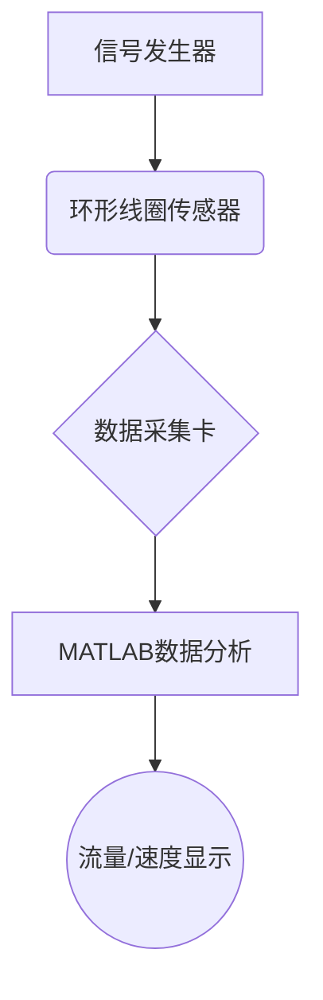

# 智能感知技术


## 第一章 传感器基础理论

### 1.1 传感器定义与发展
**国家标准定义**：  
> 能感受被测量并按规律转换为可用信号的装置（GB7665-87），典型结构包含：
> - **敏感元件**：地感线圈/压电晶体（直接感知物理量）
> - **转换元件**：信号调理电路（如ADXL345内置12位ADC）

**智能传感器八大功能**：

1. 自补偿（温度漂移<±0.1%）
2. 自诊断（故障代码E01-E05）
3. 数字量输出（RS485/CAN协议）
4. 信息存储（EEPROM容量≥8KB）

### 1.2 磁频传感器原理

​	车辆经过线圈后使车体产生**感应电流**，这一感应电流使得线圈**电感量减少**。当车辆进入线圈磁场范围时，检测器便可由**谐振电路 的电感量变化**，**检测器内部电路振荡频率**随着线圈电感量的变化 而**变化**，通过**计数脉冲数量**判断电路振荡频率的变化从而判断车 辆的有无，然后**计算相关的交通参数**。


> 金属导体置于变化着的磁 场中，导体内就会产生感 应电流，称之为电涡流或 涡流。这种现象称为涡流效应。

#### 环形线圈等效电路分析

等效电路如下：


当车辆进入线圈时，系统满足：
$$
\begin{cases} 
I_1(R_1 + jωL_1) - jωM I_2 = \dot{E} \\
I_2(R_2 + jωL_2) - jωM I_1 = 0 
\end{cases}
$$

**关键推导步骤**：
1. 解方程得线圈受金属导体涡流影响后的等效阻抗：
$$
Z = R_1 + R_2 \frac{ω^2M^2}{R_2^2 + ω^2L_2^2} + jω\left(L_1 - L_2 \frac{ω^2M^2}{R_2^2 + ω^2L_2^2}\right)
$$

2. 品质因数变化量：
$$
ΔQ = Q_0 \frac{1-\frac{L_2ω^2M^2}{L_1Z_2^2}}{1+\frac{R_2ω^2M^2}{R_1Z_2^2}}
$$

> 被测参数的变化可引起线圈的Z、L、Q 变化，所以反射式 涡流式传感器可以选择Z、L、Q中任一参数构成测量电路。由于电感量的变化表现为调谐电路频率的变化、相位的 变化和阻抗的变化，检测电感变化量一般来说有3种方式：
>
> 第一种是利用相位锁存器和鉴相器，对相位的变化进行 检测；
>
>  第二种方式是利用由环形线圈构成回路的耦合电路对其 振荡频率进行检测；
>
> 第三种是利用电压倍压器和检波器对环形线圈谐振电路 的阻抗变化进行检测。

## 第二章 惯性传感器技术 （书签）

### 2.1 加速度传感器
#### 压电效应数学模型
**正压电效应方程**：
$$
q = d \cdot F = d \cdot m \cdot a
$$
其中：
- \( d \)：压电系数（石英晶体2.3×10⁻¹² C/N）
- \( m \)：质量块重量（典型值0.1μg）

**频率响应特性**：

```python
# 二阶系统传递函数示例
import numpy as np
wn = 2*np.pi*1000 # 固有频率1kHz 
zeta = 0.007       # 阻尼比
H = lambda s: wn**2/(s**2 + 2*zeta*wn*s + wn**2)
```

### 2.2 MEMS陀螺仪
**科里奥利力核心方程**：
$$
F_c = 2m(ω \times v)
$$

**四质量块设计优势**：
1. 共模抑制比提升40dB
2. 温度漂移补偿效果：
$$
Δω_{error} = \frac{α(T) \cdot ΔT}{k_1 + k_2}
$$
（α为温度系数，k为弹性系数）

## 第三章 多传感器融合应用

### 3.1 列车组合定位
**Kalman滤波方程**：
$$
\begin{aligned}
预测阶段：& \\
\hat{x}_k^- &= F_k\hat{x}_{k-1} \\
P_k^- &= F_kP_{k-1}F_k^T + Q_k \\
更新阶段：& \\
K_k &= P_k^-H_k^T(H_kP_k^-H_k^T + R_k)^{-1} \\
\hat{x}_k &= \hat{x}_k^- + K_k(z_k - H_k\hat{x}_k^-)
\end{aligned}
$$

**误差来源分析表**：

| 传感器类型 | 误差项 | 典型值 |
|---------|-------|-------|
| MEMS陀螺 | 零偏不稳定性 | 0.1°/h |
| 里程计 | 轮径标定误差 | ±0.05% |
| GNSS | 电离层延迟 | 2-5m |

### 3.2 轨道检测系统
**多传感器时空配准模型**：
$$
\begin{bmatrix}
x \\ y \\ z
\end{bmatrix}
= 
\begin{bmatrix}
cosθ & -sinθ & 0 \\
sinθ & cosθ & 0 \\
0 & 0 & 1
\end{bmatrix}
\begin{bmatrix}
x' \\ y' \\ z'
\end{bmatrix}
+
\begin{bmatrix}
Δx \\ Δy \\ Δz
\end{bmatrix}
$$


**题目**：环形线圈电感量从200μH降至180μH，已知：
- 线圈半径r=0.5m
- 车辆底盘高度h=0.2m
- 激励频率f=10kHz

求车辆通过时的速度v？

**解答**：
1. 计算互感变化量：
$$
ΔM = \frac{μ_0N^2πr^2}{2h} = 1.25μH
$$

2. 推导速度公式：
$$
v = \frac{2πf \cdot ΔL}{\sqrt{(R^2 + (2πfL)^2)}}
$$

3. 代入得：v ≈ 28.6km/h


**智能传感器发展趋势**：
1. 感算一体化架构（延迟<1μs）
2. 仿生视觉传感器（动态范围>120dB）
3. 量子精密测量（精度达10⁻⁹量级）

---

**实验配置建议**：


> （1g=9.8m/s²，1°=π/180rad）
